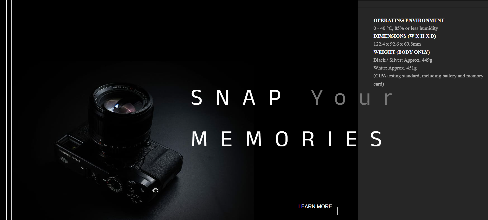
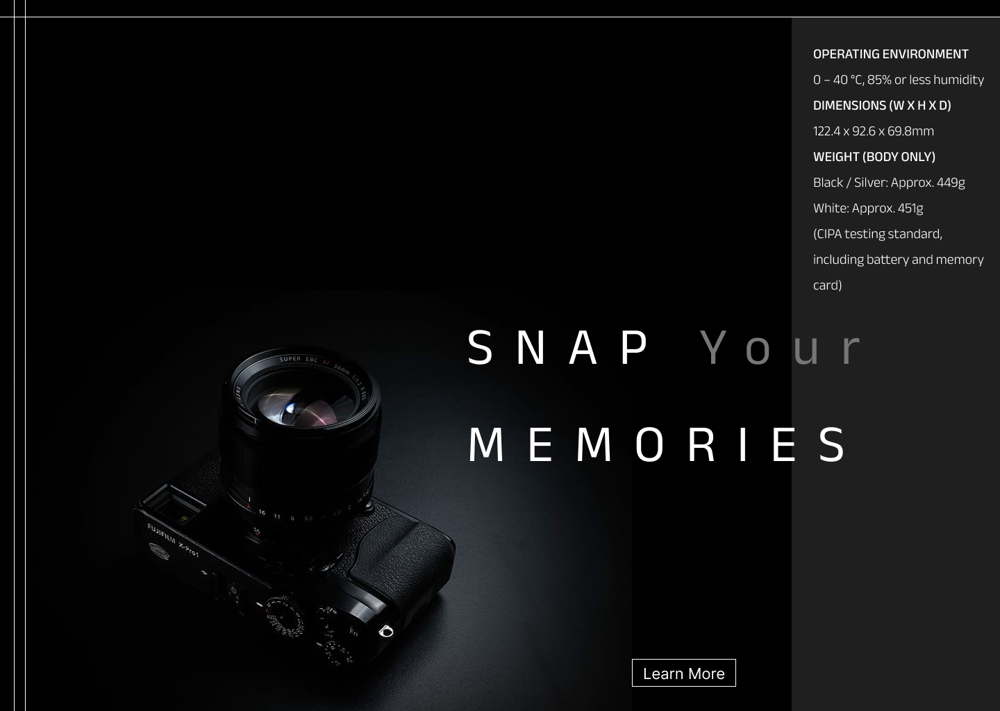

# Camera Web Homepage

A visually appealing camera-themed homepage built using **HTML** and **CSS**.

---

## 🖼️ Preview




---

## Features

- Clean UI inspired by camera brands/websites
- Responsive layout for desktop and mobile
- CSS-based layout, styling, and hover effects

---

## Tech Stack

- HTML5
- CSS3

## 🖋️ Fonts Used

- Anek Bangla
- sans-serif (fallback)


---

## How to Run

Just open the HTML file in a browser:

```bash
open index.html
